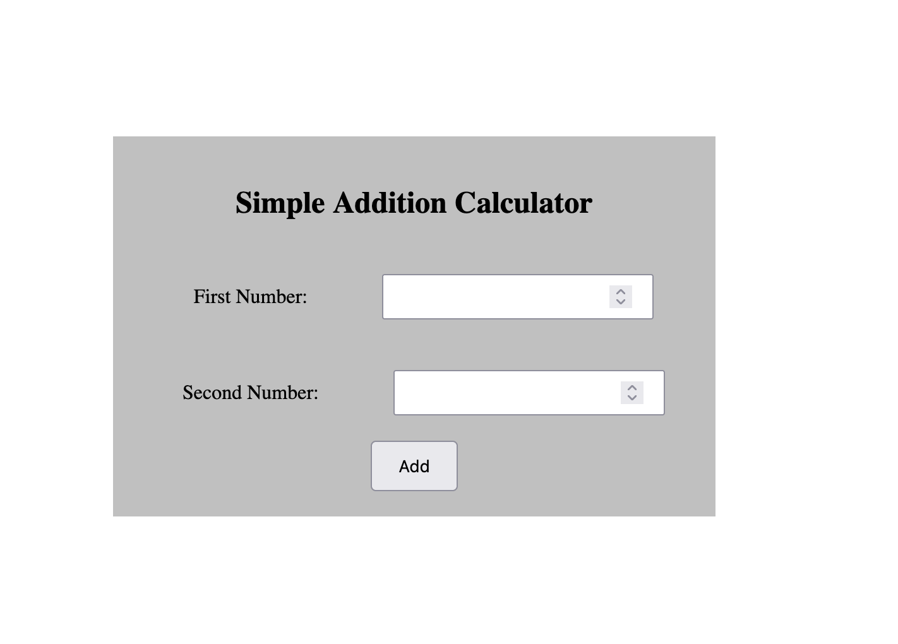
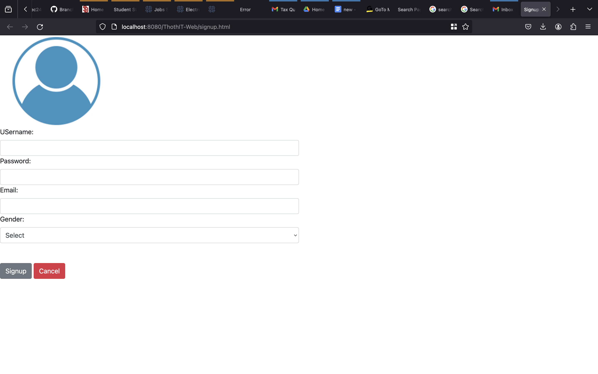
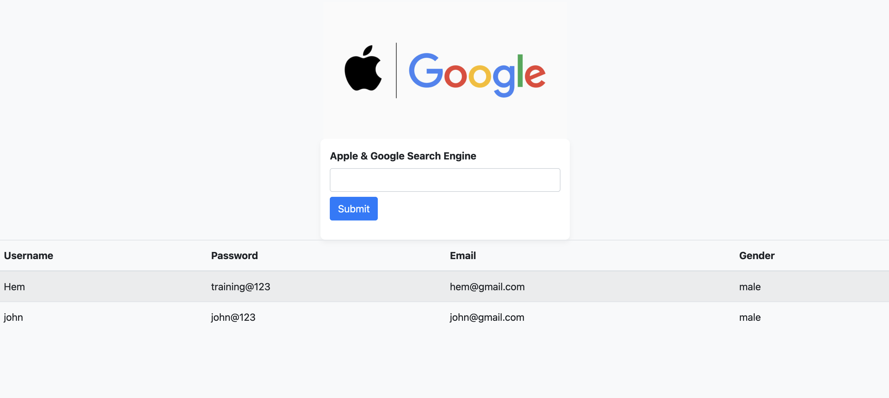
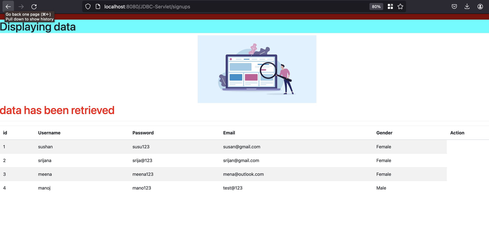

# JAVA-Basics

This repository holds the Java materials I've worked on to date. It includes:

* Example of a Basic Class Method
* Creating Servlet Example
    * Addition Cal
    
    * Login Page
    * Sign up page 
    

    * Search Bar 
    

    *Signup_JSP_Servlet_Mysql
    Develop a Signup registration page utilizing HTML and deploy it on a Tomcat server. Implement backend logic with Servlet API to communication with a MySQL database for user data storage. Employ JSP files for dynamically view the stored information.
    
